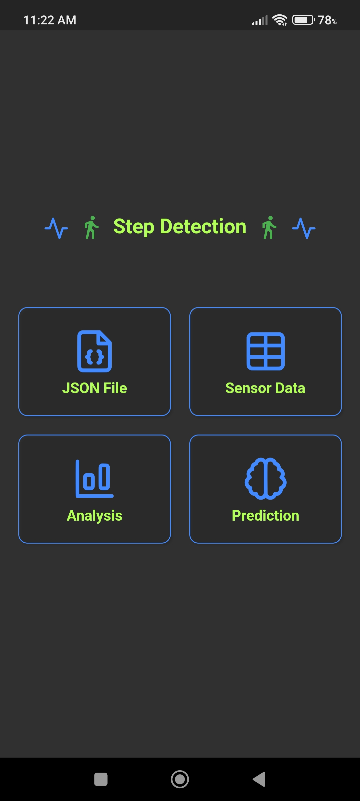
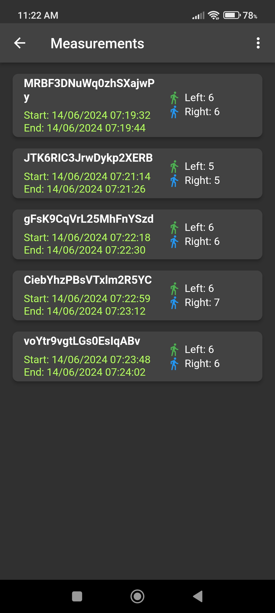
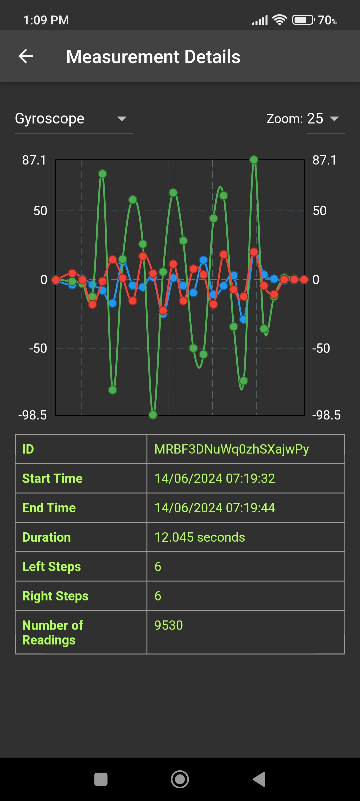
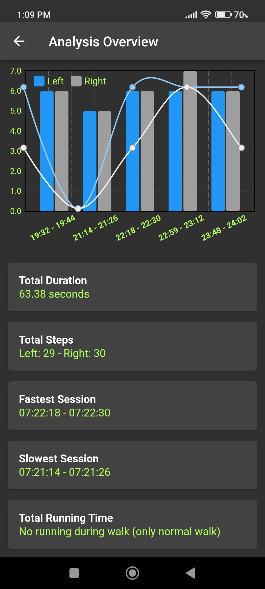
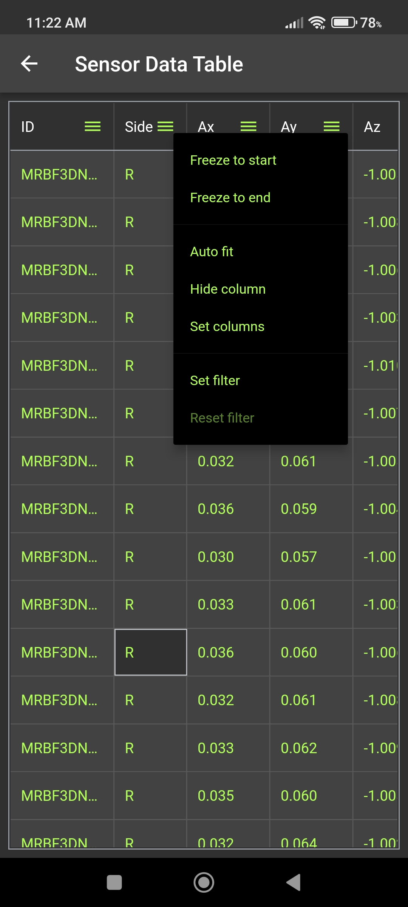
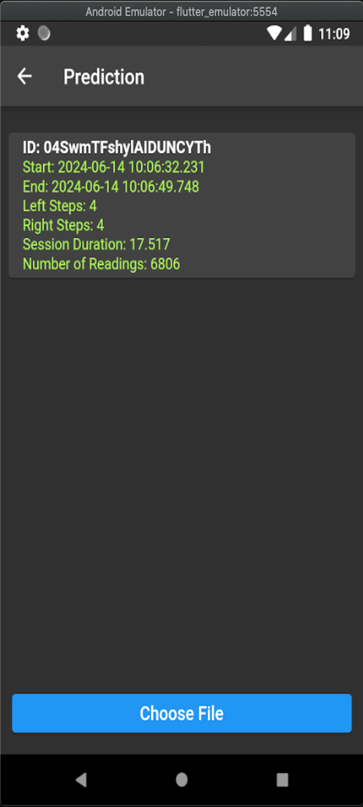

# Flutter App Screenshots

## Analysis Overview Screen

In the Analysis Overview screen, you can see the transition of the steps between time slots. Whenever there is a gap, inactivity, or rest, the line charts drop, and whenever there is activity, the spikes go up. You can observe this between **19:44 - 21:14**, where there is almost a one-minute gap of inactivity (**minutes:seconds**). This screen provides more insights and analysis based on the prediction and fetched data in real-time.

## Prediction Screen

In the Prediction screen, you can upload JSON file(s), and the model will predict the steps for both left and right feet along with other metadata. The prediction closely matches real-world scenarios.

## Measurement Details Screen

In the Measurement Details screen, you can see the prediction details, raw data, and data distribution in the **Gyroscope** and **Accelerometer** for the **x, y, and z** axes. You can **up-sample and down-sample** the data to see the distribution more clearly.

## Screenshots

<table>
  <tr>
    <td></td>
    <td></td>
    <td></td>
  </tr>
  <tr>
    <td></td>
    <td></td>
    <td></td>
  </tr>
</table>

> **Note:** You can install the app: https://github.com/arifhaidari/step_detection_flutter/tree/main/apk
